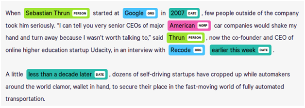

# 🧠 BERT Fine-Tuning for Named Entity Recognition (NER)

Welcome to Part 1 of our Fine-Tuning Course! In this section, we'll explore how to take a powerful **pretrained BERT model** and fine-tune it for a downstream **Named Entity Recognition (NER)** task using **Hugging Face Transformers**.

## 🚀 What We'll Do

* Understand the concept of **unsupervised pretraining**
* Perform **Supervised Fine-Tuning** (SFT) on BERT
* Conduct **Inference** on new data
* Use the **Hugging Face ecosystem** effectively

## 🧩 What is BERT?

**BERT (Bidirectional Encoder Representations from Transformers)** is a Transformer-based model developed by Google. It’s pretrained on a massive corpus (like Wikipedia and BookCorpus) in an **unsupervised** way using two self-supervised tasks:

* **Masked Language Modeling (MLM):** Random words in the input are masked and BERT learns to predict them.
* **Next Sentence Prediction (NSP):** BERT learns relationships between pairs of sentences.

Because this pretraining is **unsupervised** (i.e., it doesn't require labeled data), BERT can learn a general understanding of language.

## 🧠 How Supervised Fine-Tuning (SFT) Works

After pretraining, BERT is adapted to a specific **supervised task** (like classification, question answering, or NER) by:

1. Adding a task-specific layer (like a classification head)
2. Training on labeled data using backpropagation
3. Updating weights based on the task

In our case, we’ll fine-tune BERT for **Named Entity Recognition (NER)**.

## 🔍 What is Named Entity Recognition (NER)?

**NER** is a common NLP task where the goal is to locate and classify entities in text into predefined categories such as:

* Person names (PER)
* Organizations (ORG)
* Locations (LOC)
* Dates, Numbers, etc.

Example:

> "**Steve Jobs** founded **Apple** in **California**."
> → PER: Steve Jobs, ORG: Apple, LOC: California

## 📈 Workflow

1. **Load pretrained BERT** using Hugging Face
2. **Prepare NER dataset** (tokenization, labeling)
3. **Fine-tune BERT** with supervised training
4. **Evaluate & infer** on unseen text

## ✅ Outcome

By the end of this module, you’ll be able to:

* Understand how BERT is pretrained and fine-tuned
* Apply fine-tuning techniques to any downstream NLP task
* Train your own NER model using Hugging Face

## 📚 About the CoNLL-2003 Dataset

We’ll train our NER model using the **CoNLL-2003 dataset**, a benchmark dataset for NER provided in the Conference on Computational Natural Language Learning (CoNLL).

### 🔹 Features:

* Language: English
* Token-level annotation
* Tags: `PER`, `ORG`, `LOC`, `MISC`, and `O` (non-entity)
* Follows **IOB2 format** (Inside, Outside, Beginning)

Example:

| Word   | Tag   |
| ------ | ----- |
| Barack | B-PER |
| Obama  | I-PER |
| was    | O     |
| born   | O     |
| in     | O     |
| Hawaii | B-LOC |

### 📦 Dataset Splits:

* `train`: 14,041 sentences
* `validation`: 3,250 sentences
* `test`: 3,453 sentences

> You can load it easily using Hugging Face:
