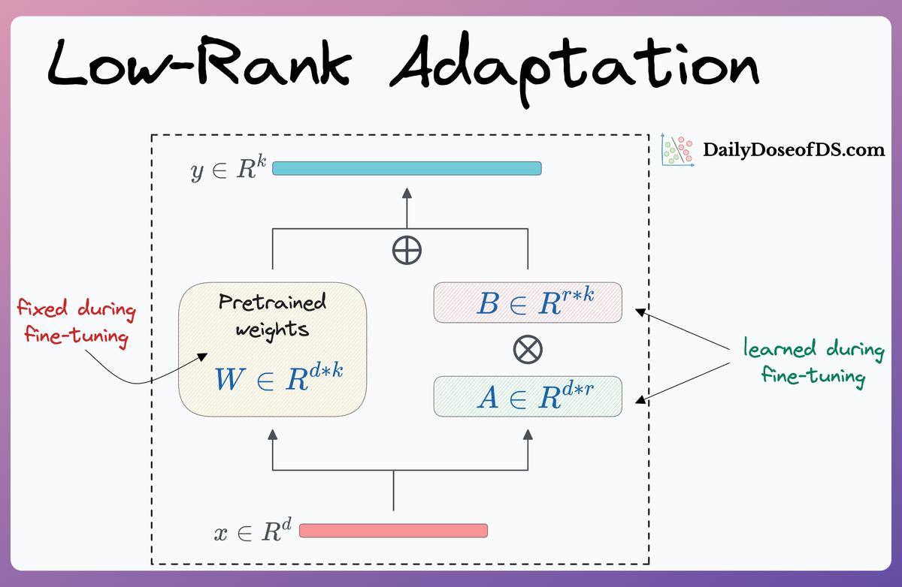
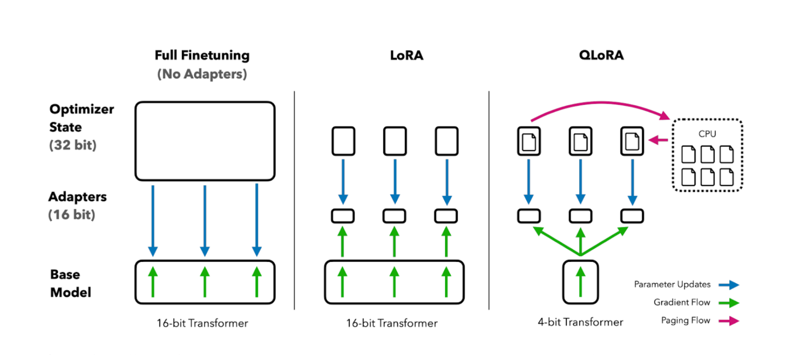

## LoRA (Low-Rank Adaptation of Large Language Models)

**LoRA** is a parameter-efficient fine-tuning method that freezes most of a model’s weights and **only adds a small number of trainable parameters** via low-rank matrices.




#### 🧠 Key Ideas:

* Decomposes weight updates into **low-rank matrices (A and B)**.
* Fine-tuning only updates these small matrices.
* Saves memory and computation.
* Great for adapting large models to new tasks with minimal cost.

#### ✍️ Example:

If your original model has a layer weight `W`, LoRA replaces it with:

```
W' = W + ΔW  →  W + A·B
```

Where:

* `A ∈ ℝ^{d×r}`
* `B ∈ ℝ^{r×k}`
* `r` is the **rank**, much smaller than `d` or `k`


## QLoRA (Quantized LoRA)


**QLoRA** builds on LoRA by **quantizing the base model** (usually to 4-bit) and then applying LoRA on top. This gives **massive memory savings** while still allowing effective fine-tuning.



#### 🔧 Key Ideas:

* Base model is **quantized to 4-bit** (e.g., using `NF4` or `GPTQ` formats).
* LoRA is applied only to a few adapter layers.
* Uses techniques like **double quantization**, **paged optimizers**, and **gradient checkpointing**.
* Enables fine-tuning 65B+ models on a **single GPU**.

#### 🧪 QLoRA Key Benefits:

* **90% memory savings**
* Almost no performance drop from full-precision training
* Works with very large open models (e.g., LLaMA, Falcon)

---

### ✅ Summary Comparison

| Feature        | LoRA                           | QLoRA                                       |
| -------------- | ------------------------------ | ------------------------------------------- |
| Base Model     | Full precision (FP16/FP32)     | 4-bit quantized                             |
| Memory Usage   | Moderate                       | Very low                                    |
| Training Speed | Fast                           | Fast, often faster                          |
| Accuracy       | Very close to full fine-tuning | Nearly the same as LoRA / full fine-tuning  |
| Ideal Use Case | Mid-size model fine-tuning     | Large model fine-tuning on limited hardware |

---

Let me know if you want code examples (e.g., with `PEFT`, `transformers`, or `bitsandbytes`) or a visual diagram of how LoRA and QLoRA work!

