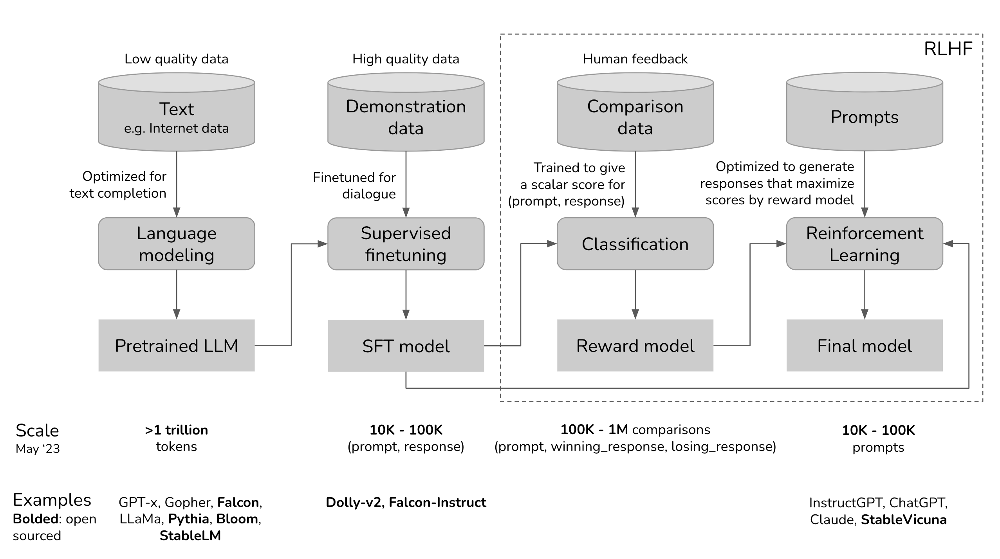
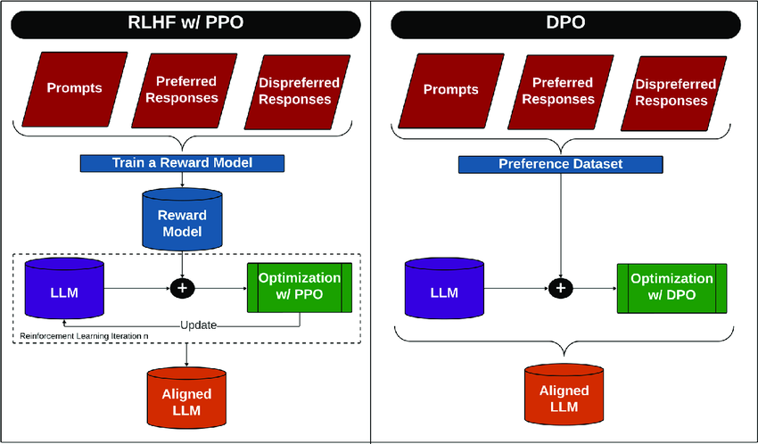

## RLHF

**RLHF (Reinforcement Learning from Human Feedback)** in short:

1. **Pretrain** LLM on large, low-quality text (e.g. internet).
2. **Supervised Fine-tuning (SFT)** on high-quality (prompt, response) pairs.
3. **Reward Model** is trained using human-ranked response comparisons.
4. **Reinforcement Learning** uses the reward model to improve outputs.
5. **Final model** generates responses optimized for human preferences.

**Examples**: ChatGPT, InstructGPT, Claude.
**Open-source**: Dolly-v2, StableVicuna, Falcon-Instruct.

### 🔁 **PPO (Proximal Policy Optimization)**

* Classic reinforcement learning algorithm.
* Used in **InstructGPT, ChatGPT**.
* Optimizes the model to maximize reward (from the reward model) while keeping changes from the original model small.
* Computationally intensive.

### ⚖️ **DPO (Direct Preference Optimization)**

* **No reward model needed**.
* Uses comparison data (e.g., preferred vs. rejected responses) directly.
* Optimizes the model to prefer human-preferred responses over rejected ones.
* Simpler and **more efficient than PPO**.

